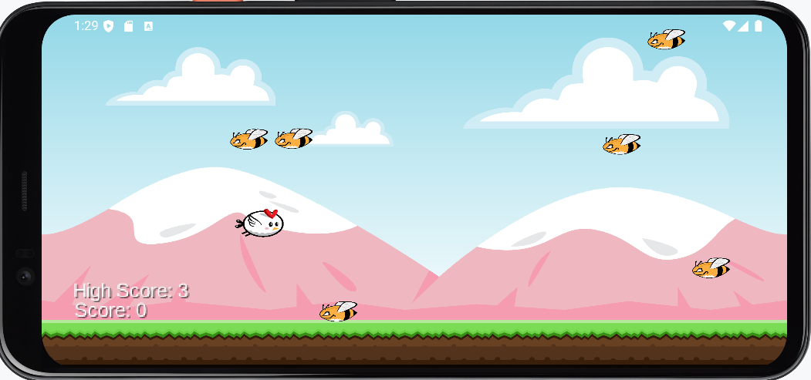

# 🐤 SurvivorBird

SurvivorBird is a simple yet addictive 2D survival game developed with [LibGDX](https://libgdx.com/). You control a little bird flying through the sky, trying to dodge randomly positioned bees. The longer you survive, the higher your score!

---

## 🎮 Gameplay

- Tap to make the bird fly upward.
- Avoid the bees — they come in randomly offset groups of three.
- Each time you pass a group of bees, your score increases.
- The bees speed up gradually, increasing difficulty.
- Try to beat your **high score**, which is tracked automatically!

---

## ✨ Features

- 🐝 Dynamic enemy generation with randomized vertical offsets
- ⚙️ Gradually increasing difficulty as your score rises
- 📊 Real-time score and high score tracking
- 🎯 Intuitive tap-based control
- 💥 Collision detection using geometric intersections
- 📱 Android support + Desktop support

---

## 🧪 Technologies Used

| Tool       | Purpose                        |
|------------|--------------------------------|
| Java       | Core programming language      |
| LibGDX     | Game development framework     |
| Gradle     | Build automation               |
| Android SDK | Android platform support      |
| Git        | Version control                |

